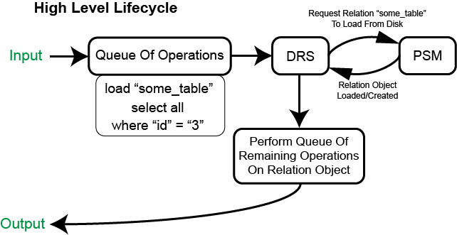
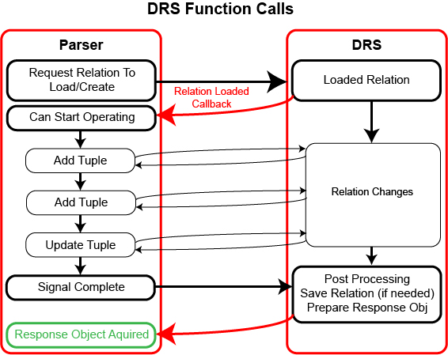
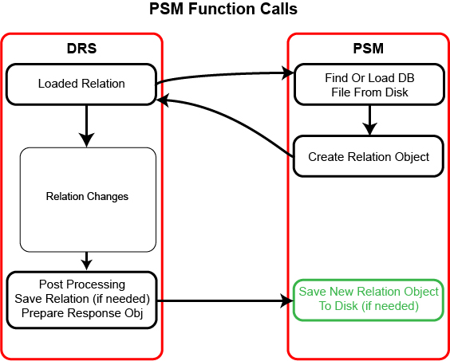
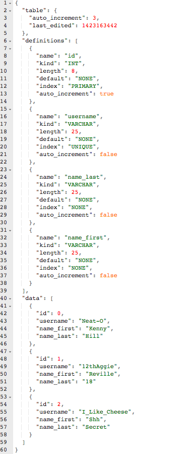

## CSCE-315-Project-2 SQL Database & Frontend Client

### Team Members
* Michael Turner
* Nicolette (Nikki) Schreier
* Rafael (Raf) Salas
* Robert (Bob) Timm

## Guidelines
This project consists of two parts:
* Implement a simple database management system (DBMS) and provide your binaries (not the source code) to another designated team.
* Write a DB application using the DBMS binaries supplied to you by another designated team.
* For more information please refer to [this](project-guidelines.pdf) nine page outline.

### For this application I developed the following systems:
#### Key Terms
* **Relation** - also known as a table in SQL.
* **Relation Object** - a relation, but loaded in memory and represented by a C++ object.
* **Tuple** - also known as a row (single entry of data) in SQL.

#### Section 1 – State the purpose of your project/sub-system
The purpose of this portion of the system is to serve two primary functions, 1) Provide a set of publicly accessible functions for creating, loading, manipulating and storing data, 2) Provide a system that is capable of persisting aforementioned data between sessions. For sake of naming conventions the former system shall be known as the **Dynamic Relation System (DRS)** and the latter shall be known as the **Persistent Storage Manager (PSM)**. This system is not capable of directly handling SQL queries, it is however capable of mimicking them through a series of function calls. More on this will be covered in a section outlining testing. 

##### Dynamic Relation System (DRS)
As mentioned above, this system is capable of emulating all the operations available by a typical SQL query. This is done through a series of function calls that will later be initiated by the actual SQL parser (outlined in a later document). This system shall create a base data type for each known data type in SQL, and represent it as a sole object. Within each of these objects there lies a conversion from a known C++ data type to SQL data type so that it may be manipulated by the engine. From there we define a relation (table) object. Each relation can contain any number of aforementioned SQL data objects. This will allow each table loaded into memory to be evaluated using a set of core function calls from counting rows, searching (WHERE), deleting rows, updating rows, etc. This system shall also interface with a system for loading and saving this data to disk (Persistent Storage Manager).

##### Persistent Storage Manager (PSM)
This system is designed to manage the storage and retrieval process of relations (tables) from memory. This system shall be designed such that the structure of each relation is unknown until the relation is loaded from memory and constructed into a relation object. Each relation shall be stored in an individual file where the name of the file is also the name of the table. When a file is loaded from disk the first section of the document will outline the structure of the given relation (table) so that the relation object can be allocated. The remainder of the document will be structured in a way that allows each row (tuple) to be read into the corresponding data object originally allocated when the relation object was created. This not only allows for the database files to be well structured and dynamic but for debugging purposes will make them easier to understand and read. After the given relation is loaded into memory as an object the DRS will then be able to manipulate the object as described above. When all operations have been completed the DRS will respond with either an error or desired result and the PSM will save the relation object back to disk (if a save is necessary).

#### Section 2 – Define the high level entities in your design

As shown in the above graphic this system takes care of loading a necessary relation, performing some list or sequence of operations on the relation, then returning the new relation (and saving it back to disk if also needed). The idea here is that once the system loads or creates a relation, any number of functions can then be used on the specific relation. Tuples can be updated, added, truncated, counted, along with any number of relational algebraic operations. If any of these operations changes the structure of the relation, for instance an update, a save operation will be flagged and executed when all operations are complete. These post processing routines (like save) will be executed when a final callback is executed by the parsing system. With this system there will also exist a response object that will encompass all data output by the DRS. This object will contain a flag that lets the parser know if any errors occurred during operation and will also contain a list of error messages that can be output if so desired. Typically the parser will get back a response object and check if any errors have occurred before further manipulating the data. 

#### Section 3 – For each entity, define the low level design
##### Dynamic Relation System (DRS)

As seen in the above diagram the main goal of the DRS is to allow the parser to initiate any number of operations on the the relation object once the relation is loaded into memory. In this particular example  the system is adding two rows and performing an update. This loose style of implementation is intended to remain stateless so that each operation exists in its own space. Essentially the imposed SQL grammar and resulting order of operations will fall on the parser. The DRS is merely a medium for operating on the data to achieve the intended result as intended by any SQL query. By allowing any sequence of operations to take place on a relation object, the DRS remains ambiguous and open to other language implementations in the future. 
##### Persistent Storage Manager (PSM)

The PSM is a little less complicated in terms of functionality when compared to the DRS. This system is designed to take a stored file on disk and turn it into a relation object. The same applies for the saving process as well. Each relation object, no matter its size, construction or affiliated data types can be converted into a savable file and created from a file stored on disk. The markup for these files shall be JSON and will contain three major sections, **table**, **definitions** and **data**. Wherein the definition portion will contain the necessary markup to create any type of relation object with any varying number of columns and data types. The data portion will contain structured segments corresponding to each and every tuple in the relation. Lastly, the table portion will contain any information relating directly to the table, such as the current index for the auto_increment of the primary key.

##### Sample Database File For PSM (in JSON)
This relation has three tuples (rows) and four attributes (columns). 

#### Section 4 – Benefits, assumptions, risks/issues
##### Benefits
* Structured database files will aid in readability and debugging. Since these documents will be more readable than comma delimited files.
* A system that can initiate any sequence of operations on the relation object will impose less restrictions on the parser and grammar interpretations. 
* Simple response object will create better error handling and reporting, even after many operations take place on a relation.

### Plagiarism Notice
If you are working on an assignment for a University or High School course you must check with your professor and/or school's guidelines on plagiarism before copying any work found in this codebase. The author of this code is not to be held responsible for acts of cheating or misconduct. The author, much like the creator of a scholastic paper or article has decided to post this codebase for educational purposes. If you are a professor or course admin that is having an issue with cheating in your class, please feel free to contact the author.

### License
Copyright (c) 2015 Robert Timm, Michael Turner, Nicolette (Nikki) Schreier, Rafael (Raf) Salas

Permission is hereby granted, free of charge, to any person obtaining a copy of this software and associated documentation files (the "Software"), to deal in the Software without restriction, including without limitation the rights to use, copy, modify, merge, publish, distribute, sublicense, and/or sell copies of the Software, and to permit persons to whom the Software is furnished to do so, subject to the following conditions:

The above copyright notice and this permission notice shall be included in all copies or substantial portions of the Software.

THE SOFTWARE IS PROVIDED "AS IS", WITHOUT WARRANTY OF ANY KIND, EXPRESS OR IMPLIED, INCLUDING BUT NOT LIMITED TO THE WARRANTIES OF MERCHANTABILITY, FITNESS FOR A PARTICULAR PURPOSE AND NONINFRINGEMENT. IN NO EVENT SHALL THE AUTHORS OR COPYRIGHT HOLDERS BE LIABLE FOR ANY CLAIM, DAMAGES OR OTHER LIABILITY, WHETHER IN AN ACTION OF CONTRACT, TORT OR OTHERWISE, ARISING FROM, OUT OF OR IN CONNECTION WITH THE SOFTWARE OR THE USE OR OTHER DEALINGS IN THE SOFTWARE.
